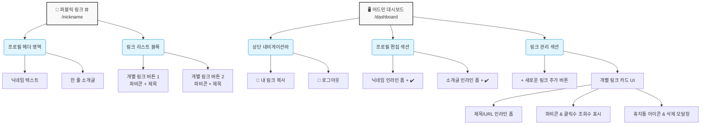

# 와이어프레임 및 물리적 UI 구조 (Wireframe) - 마이링크 (MyLink)

본 문서는 마이링크 서비스의 주요 화면 레이아웃을 설명하기 위해 **Mermaid 시각화 다이어그램**과 **ASCII 아트 스타일**로 작성된 와이어프레임 구조도입니다.

---

## 1. 인터페이스 아키텍처 (Mermaid Component Diagram)

마이링크의 전체 페이지 구성 요소를 컴포넌트 단위로 나눈 시각적 구조도입니다.



---

## 2. ASCII 모드 와이어프레임 레이아웃

### 2.1 퍼블릭 뷰 (Public Web View)
사용자가 `mylink.com/닉네임`으로 접속했을 때 마주하게 되는 모바일 최적화 엔드 유저 화면입니다. 프로필 이미지가 제거되어 매우 깔끔하고 집중도 높은 UI를 제공합니다.

```text
 ┌───────────────────────────────────────────────────┐
 │                                                   │
 │                                                   │
 │                 @developer_ko                     │
 │          "프리랜서 프론트엔드 개발자"             │
 │                                                   │
 │                                                   │
 │   ┌───────────────────────────────────────────┐   │
 │   │  [G]  GitHub Repository                   │   │
 │   └───────────────────────────────────────────┘   │
 │                                                   │
 │   ┌───────────────────────────────────────────┐   │
 │   │  [B]  프론트엔드 기술 블로그              │   │
 │   └───────────────────────────────────────────┘   │
 │                                                   │
 │   ┌───────────────────────────────────────────┐   │
 │   │  [L]  LinkedIn 프로필                     │   │
 │   └───────────────────────────────────────────┘   │
 │                                                   │
 └───────────────────────────────────────────────────┘
```
**구성 특징:**
- 수직 중앙 정렬 기반(Column Layout)
- 아바타 프로필 없이 큰 폰트의 닉네임과 서브 텍스트(소개글)만 노출
- 좌측에 구글 API를 통해 가져온 파비콘(Favicon)이 배치된 간결한 리스트 버튼

<br>

### 2.2 어드민 대시보드 (Admin Dashboard View)
소유자가 로그인하여 링크를 관리하는 단일 스크롤 화면입니다. 모든 텍스트 편집은 인라인 방식(제자리 클릭 후 수정)으로 이뤄지며, 저장 확인을 위한 체크(`✔️`) 버튼이 붙어 있습니다.

```text
 ┌───────────────────────────────────────────────────┐
 │ [🚪로그아웃]                         [🔗링크복사] │
 ├───────────────────────────────────────────────────┤
 │                                                   │
 │ ▼ 프로필 설정                                     │
 │                                                   │
 │   닉네임:  developer_ko                      [✔️] │
 │   소개글:  프리랜서 프론트엔드 개발자        [✔️] │
 │                                                   │
 ├───────────────────────────────────────────────────┤
 │                                                   │
 │ ▼ 내 링크 리스트                  [+ 링크 추가]   │
 │                                                   │
 │  ┌─────────────────────────────────────────────┐  │
 │  │ [G] GitHub Repository                  [✔️] │  │
 │  │     https://github.com/...                  │  │
 │  │                                             │  │
 │  │ ──> (클릭 카운트: 1,204회)             [🗑️] │  │
 │  └─────────────────────────────────────────────┘  │
 │                                                   │
 │  ┌─────────────────────────────────────────────┐  │
 │  │ [B] 프론트엔드 기술 블로그             [✔️] │  │
 │  │     https://blog.my-domain.com              │  │
 │  │                                             │  │
 │  │ ──> (클릭 카운트: 342회)               [🗑️] │  │
 │  └─────────────────────────────────────────────┘  │
 │                                                   │
 └───────────────────────────────────────────────────┘
```
**구성 특징:**
- **인라인 편집 뷰:** 네모 칸 요소(닉네임, 소개글, 링크 제목, 링크 URL 영역)를 클릭하면 색상이 바뀌며 즉시 키보드 타이핑 모드로 전환됩니다. 입력을 마치고 우측의 `✔️` 버튼을 누르면 DB에 저장됩니다.
- **클릭 카운트 뷰:** 좌측 하단 등에 누적 클릭 조회수가 노출되어 각 항목별 성과를 볼 수 있습니다.
- **안전 삭제 UI:** `[🗑️]` 버튼 클릭 직후, 중앙 팝업으로 *정말 삭제할지*를 확인하는 다이얼로그 모달이 나타납니다.
