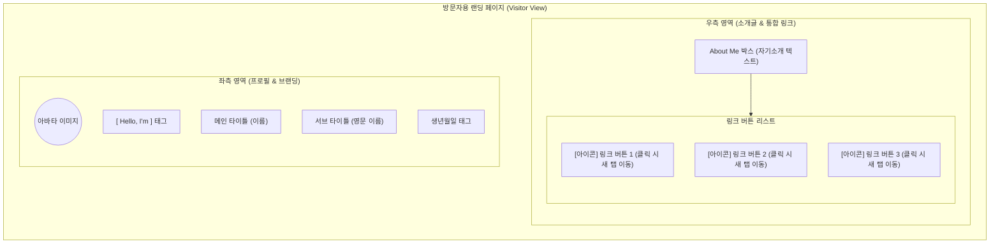
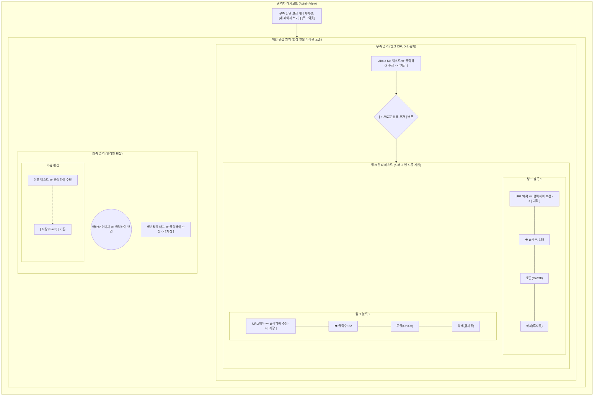

# MyLink - 와이어프레임 (Wireframe)

본 문서는 마이링크(MyLink) 프로젝트의 전체적인 화면 구조(레이아웃)와 구성 요소들의 배치를 정의합니다. 네오 브루탈리즘 스타일을 반영한 넓은 데스크탑 랜딩 페이지 레이아웃을 기준으로 작성되었습니다. 모바일에서는 아래의 좌측 영역이 상단으로, 우측 영역이 하단으로 스택(Stack)되어 일렬로 나열됩니다.

---

## 1. 방문자 화면 (Visitor View)
방문자가 마이링크 URL에 접속했을 때 보게 되는 최종 랜딩 페이지입니다. 편집 아이콘이나 버튼 없이 깔끔한 결과물만 노출됩니다.

---

## 2. 관리자 대시보드 화면 (Admin View)
소유자가 로그인한 후 진입하는 마이 페이지(관리자 페이지)입니다. 모든 편집 가능한 텍스트 옆에는 항상 **[✏️ 연필 아이콘]**이 표시되어 수정 가능함을 직관적으로 안내합니다.

---

### 💡 와이어프레임 주요 UX 포인트
1. **명확한 모드 구분 및 전환:** 관리자 화면 우측 상단에 `[내 페이지 보기]` 버튼을 고정 배치하여, 언제든지 방문자 입장에서 렌더링된 최종 화면을 확인할 수 있게 합니다.
2. **시각적 편집 어포던스 (Pencil Icon):** 인라인 에디팅 기능이 자칫 단순한 텍스트로 오인되지 않도록, 관리자 화면(My Page)에서 수정이 가능한 모든 영역 옆에는 항상 `✏️ 연필 아이콘`을 노출시켜 "클릭하면 수정할 수 있음"을 직관적으로 안내합니다. (이 아이콘은 방문자 뷰에서는 절대 보이지 않습니다.)
3. **명시적 저장 (Safe Editing):** 텍스트(연필 아이콘 영역)를 클릭하여 수정하는 동안 발생할 수 있는 데이터 증발 실수를 막기 위해, 내용 변경 후 반드시 나타나는 **`[저장]`** 버튼을 눌러야만 업데이트됩니다.
